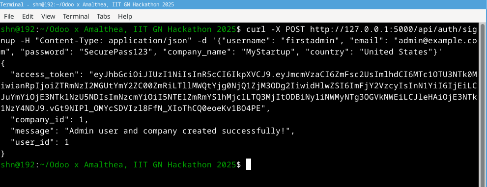
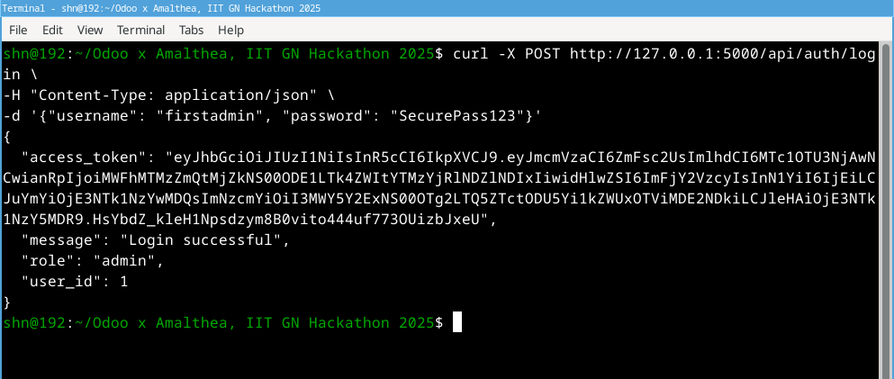
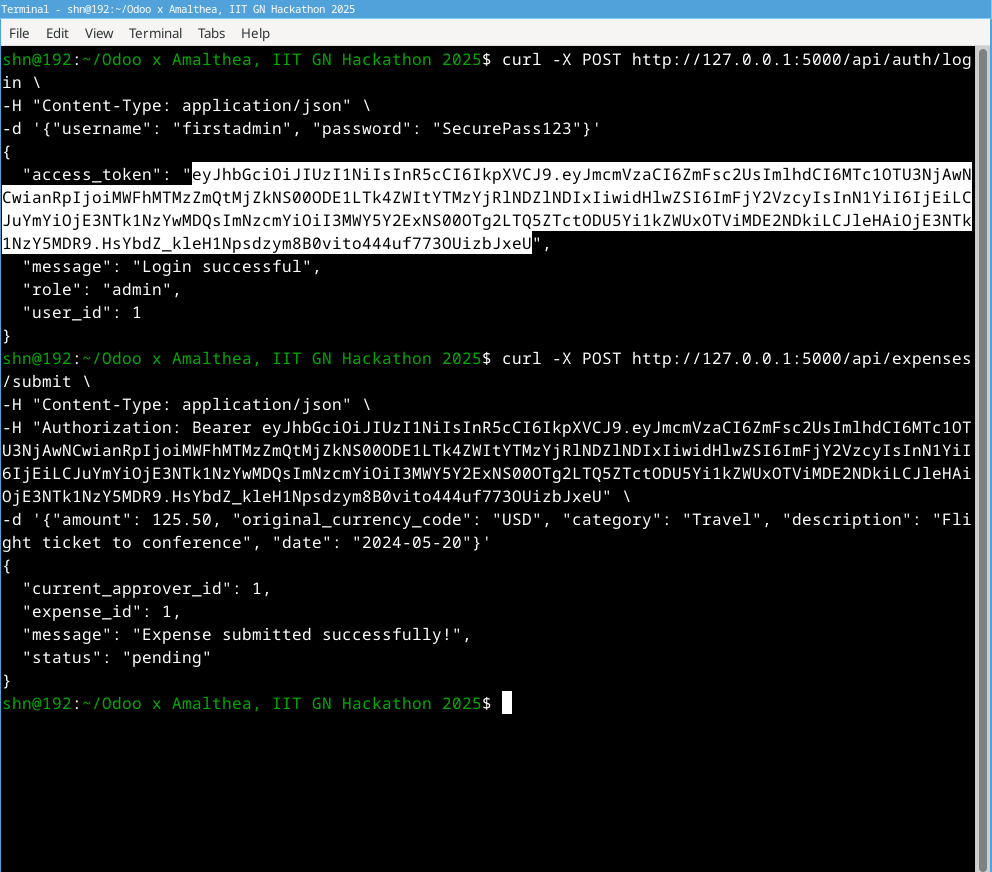
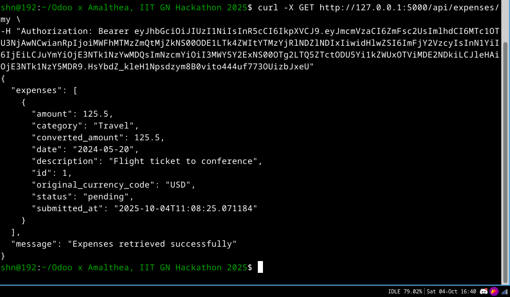
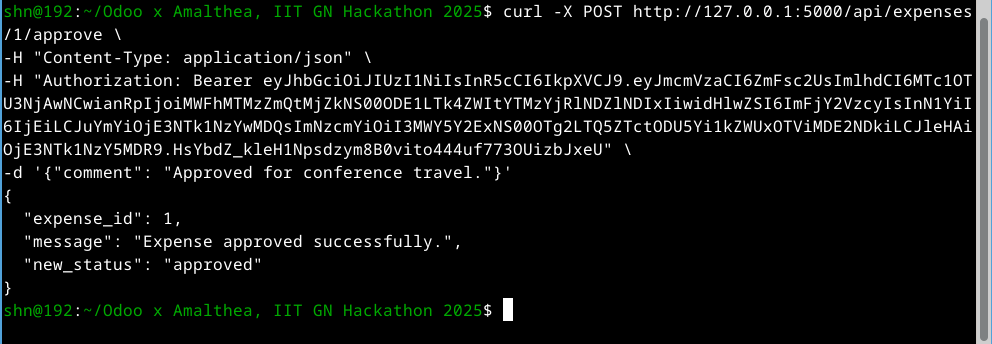

# 🎩 Peaky Blinders Expense Management System 🎩

> **A backend API solution for automating company expense reimbursement processes, built during the Odoo x Amalthea, IIT GN Hackathon 2025.**

## Table of Contents
- [Project Vision](#project-vision)
- [Features](#features)
- [Tech Stack](#tech-stack)
- [Setup Instructions](#setup-instructions)
- [Database Schema](#database-schema)
- [API Endpoints](#api-endpoints)
- [API Interaction Examples (using `curl`)](#api-interaction-examples-using-curl)
- [Development Approach](#development-approach)
- [Current Status (What Works & What Doesn't)](#current-status-what-works--what-doesnt)
- [Next Steps](#next-steps)
- [Built With](#built-with)

## Project Vision
This project aims to automate the company expense reimbursement process using a robust backend API. It implements a multi-step approval workflow based on company rules and user roles, ensuring transparency and efficiency. While the backend API is the primary focus and is largely functional, the frontend provides a thematic "Peaky Blinders" interface, currently tested primarily via API calls.

## Features
*   **User Authentication & Authorization (JWT):** Secure signup and login for employees, managers, and admins.
*   **Role-Based Access:** Different permissions for employees (submit/view own expenses), managers (approve/reject), and admins (manage users, rules).
*   **Expense Submission:** Employees can submit expenses with amount, currency, category, description, and date.
*   **Expense Management:** Users can view their submitted expenses and their status (pending, approved, rejected).
*   **Approval Workflow (Backend Logic):** Managers can approve or reject expenses assigned to them.
*   **Currency Conversion:** (Conceptually integrated, relies on external API calls within the backend).
*   **Database Integration:** Uses SQLAlchemy ORM for database operations.

## Tech Stack
*   **Backend:** Python, Flask
*   **Database:** SQLAlchemy (ORM), SQLite (for development)
*   **Authentication:** Flask-JWT-Extended
*   **Security:** Flask-Bcrypt (Password Hashing)
*   **Frontend:** HTML, CSS (Thematic "Peaky Blinders" styling), Jinja2 (Template Engine)
*   **API Testing:** `curl`, Postman

## Setup Instructions
1.  **Clone the Repository:**
    ```bash
    git clone https://github.com/shn-sudo/Odoo-x-Amalthea-IIT-GN-Hackathon-2025.git
    cd Odoo-x-Amalthea-IIT-GN-Hackathon-2025
    ```

2.  **Create and Activate Virtual Environment:**
    ```bash
    python -m venv venv
    # On Windows:
    # venv\Scripts\activate
    # On macOS/Linux:
    source venv/bin/activate
    ```

3.  **Install Dependencies:**
    ```bash
    pip install -r requirements.txt
    ```

4.  **Run the Application:**
    ```bash
    python app.py
    ```
    The API should be running on `http://127.0.0.1:5000/`.

## Database Schema
*   **`Company`:**
    *   `id` (Primary Key)
    *   `name` (Unique)
    *   `base_currency_code`
    *   `created_at`
*   **`User`:**
    *   `id` (Primary Key)
    *   `username` (Unique)
    *   `email` (Unique)
    *   `password_hash`
    *   `role` (employee, manager, admin)
    *   `company_id` (Foreign Key)
    *   `manager_id` (Self-referencing Foreign Key)
    *   `is_manager_approver`
    *   `created_at`
*   **`Expense`:**
    *   `id` (Primary Key)
    *   `amount`
    *   `original_currency_code`
    *   `converted_amount`
    *   `category`
    *   `description`
    *   `date`
    *   `receipt_image_path`
    *   `status` (pending, approved, rejected)
    *   `submitted_by_id` (Foreign Key)
    *   `submitted_at`
    *   `current_approver_id` (Foreign Key)
*   **`Approval`:**
    *   `id` (Primary Key)
    *   `expense_id` (Foreign Key)
    *   `approver_id` (Foreign Key)
    *   `status` (pending, approved, rejected)
    *   `comment`
    *   `approved_at`
*   **`ApprovalRule`:**
    *   `id` (Primary Key)
    *   `name`
    *   `company_id` (Foreign Key)
    *   `percentage_required`
    *   `specific_approver_required_id` (Foreign Key)
    *   `is_hybrid_rule`
    *   `rule_type` (percentage, specific, hybrid)
    *   `sequence_order`

## API Endpoints

### Authentication
*   `POST /api/auth/signup`
    *   **Purpose:** Register a new user.
    *   **Request Body:** `{"username": "...", "email": "...", "password": "...", "role": "employee|manager|admin", "company_id": <int>, "manager_id": <int> (optional)}`
    *   **Response:** `{"msg": "User registered successfully"}` or error message.

*   `POST /api/auth/login`
    *   **Purpose:** Authenticate a user and return a JWT access token.
    *   **Request Body:** `{"username": "...", "password": "..."}` (or `{"email": "...", "password": "..."}`)
    *   **Response:** `{"access_token": "<token>"}` or error message.

### Expenses
*   `POST /api/expenses/submit`
    *   **Purpose:** Submit a new expense claim.
    *   **Headers:** `Authorization: Bearer <access_token>`
    *   **Request Body:** `{"amount": <float>, "original_currency_code": "USD|EUR|GBP|...", "category": "...", "description": "...", "date": "YYYY-MM-DD"}`
    *   **Response:** `{"msg": "Expense submitted successfully", "expense_id": <int>}` or error message.

*   `GET /api/expenses/my`
    *   **Purpose:** Retrieve expenses submitted by the authenticated user.
    *   **Headers:** `Authorization: Bearer <access_token>`
    *   **Response:** `{"expenses": [{...}, {...}]}`

*   `GET /api/expenses/pending`
    *   **Purpose:** Retrieve expenses pending approval for the authenticated user (if they are a manager/approver).
    *   **Headers:** `Authorization: Bearer <access_token>`
    *   **Response:** `{"pending_expenses": [{...}, {...}]}`

*   `POST /api/expenses/<int:expense_id>/approve`
    *   **Purpose:** Approve a pending expense.
    *   **Headers:** `Authorization: Bearer <access_token>`
    *   **Request Body:** `{"comment": "..."} (optional)`
    *   **Response:** `{"msg": "Expense approved successfully"}` or error message.

*   `POST /api/expenses/<int:expense_id>/reject`
    *   **Purpose:** Reject a pending expense.
    *   **Headers:** `Authorization: Bearer <access_token>`
    *   **Request Body:** `{"comment": "..."} (optional)`
    *   **Response:** `{"msg": "Expense rejected successfully"}` or error message.

## API Interaction Examples (using `curl`)

Here are screenshots demonstrating successful calls to the API endpoints using `curl`:

### Starting the Application
 <!-- This image might not exist yet; you can take one showing 'Running on http://127.0.0.1:5000/' -->

### User Signup


### User Login (Obtaining JWT Token)


### Submitting an Expense


### Viewing Own Expenses


### Approving an Expense


## Development Approach
1.  **Start Small, Think Big:** Began with core backend API authentication and expense submission.
2.  **Modular Architecture:** Separated concerns (Models, Utilities, Routes) within `app.py`.
3.  **Test as You Go:** Used `curl` extensively to verify API endpoints.
4.  **Document Everything:** Maintaining this `README.md` and code comments.
5.  **Integrate Frontend:** Added Flask routes to render HTML templates and implemented basic session management for the frontend.

## Current Status (What Works & What Doesn't)

*   **✅ Backend API:** Core functionality (signup, login, expense submission, viewing, approval/rejection) is implemented and tested via `curl`. All endpoints listed above work.
*   **✅ Database Models:** SQLAlchemy models for User, Expense, Approval, ApprovalRule, Company are defined and functional.
*   **✅ Authentication:** JWT-based authentication is working.
*   **✅ Basic Frontend Templates:** HTML pages (`login.html`, `signup.html`, `admin_dashboard.html`, `employee_dashboard.html`, `manager_dashboard.html`) are created in the `templates/` folder with thematic styling.
*   **❌ Full Frontend Integration:** While the frontend pages exist, the JavaScript interaction between these pages and the backend API (via `fetch` or similar) is not fully implemented or tested. The primary demonstration of functionality is via `curl` commands.
*   **❌ Session Handling for Direct Route Access:** Navigating directly to `/employee`, `/manager`, or `/admin` routes might not work correctly if the Flask `session` is not properly set after API calls. This needs debugging.
*   **❌ Admin Management UI:** Frontend pages for admin user/role management and rule management are planned but not fully implemented.
*   **❌ Advanced Approval Rules:** The backend logic for complex, rule-based multi-step approvals is partially implemented but might require further refinement.
*   **❌ Receipt Upload:** File upload for receipts is not fully implemented in the API endpoint or frontend.
*   **❌ OCR:** Not implemented as a core feature.

## Next Steps
1.  Complete backend API features (e.g., admin user/role management, admin rule management).
2.  Develop the frontend interface fully, ensuring seamless interaction with the backend API.
3.  Implement more complex approval rule logic.
4.  Add comprehensive error handling and logging.
5.  Finalize documentation.

## Built With
*Made with ❤️ during the Odoo x Amalthea, IIT GN Hackathon 2025.*